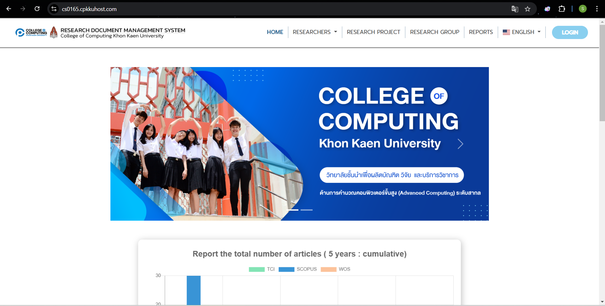
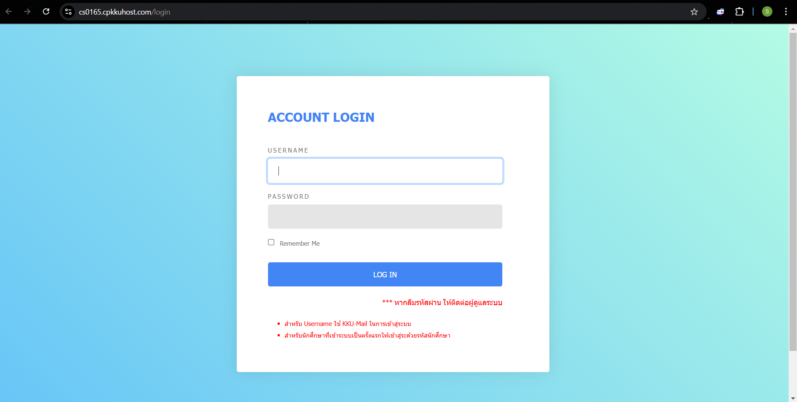
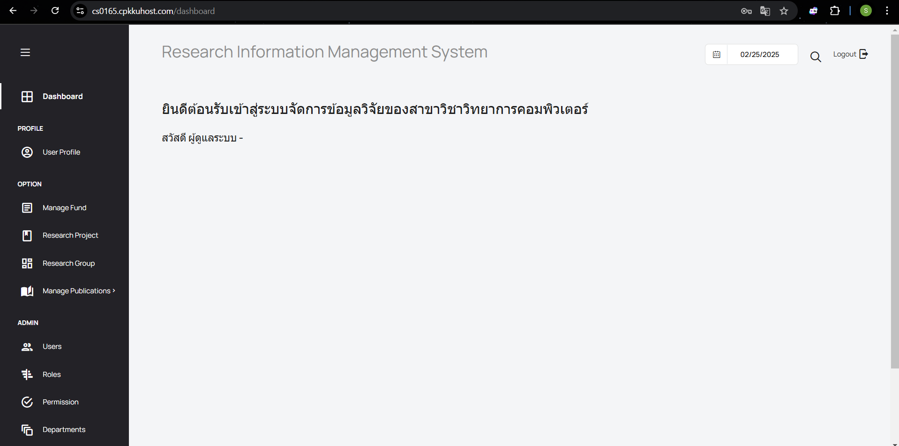
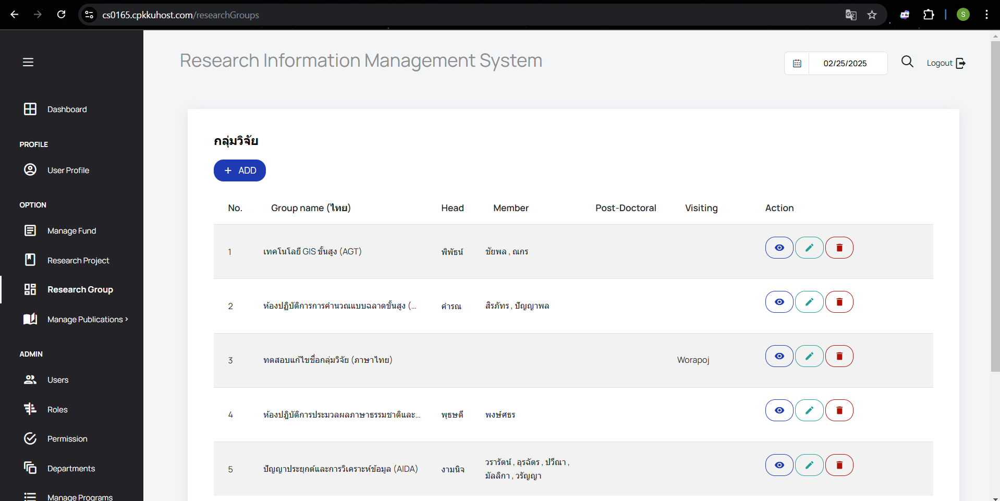

# User Manual
## เข้าสู่เว็บไซต์

1. เปิดเบราว์เซอร์ของคุณ (เช่น Google Chrome, Firefox, หรือ Microsoft Edge)
2. เข้าสู่เว็บไซต์โดยพิมพ์ URL ในแถบที่อยู่: URL: (https://cs0165.cpkkuhost.com)
   หรือ [Website](https://cs0165.cpkkuhost.com/)
3. เมื่อเข้าสู่หน้าแรกของเว็บไซต์แล้วจะแสดงเมนูหลักและฟังก์ชันต่าง ๆ
   
   

# Admin
## เข้าสู่ระบบ
1. กดที่ปุ่ม LOGIN มุมขวาบนของเว็บไซต์
2. กรอก Username และ Password ที่ได้รับ จากนั้นกด LOG IN
   

## ดูกลุ่มวิจัย
1. เลือกเมนู Research Group จาก side bar
   
2. จะแสดงกลุ่มวิจัยทั้งหมด โดย **Admin จะสามารถดู แก้ไข และลบ กลุ่มวิจัยได้**
   

1. **Install Dependencies**: 
    ```bash
    composer update
    ```
