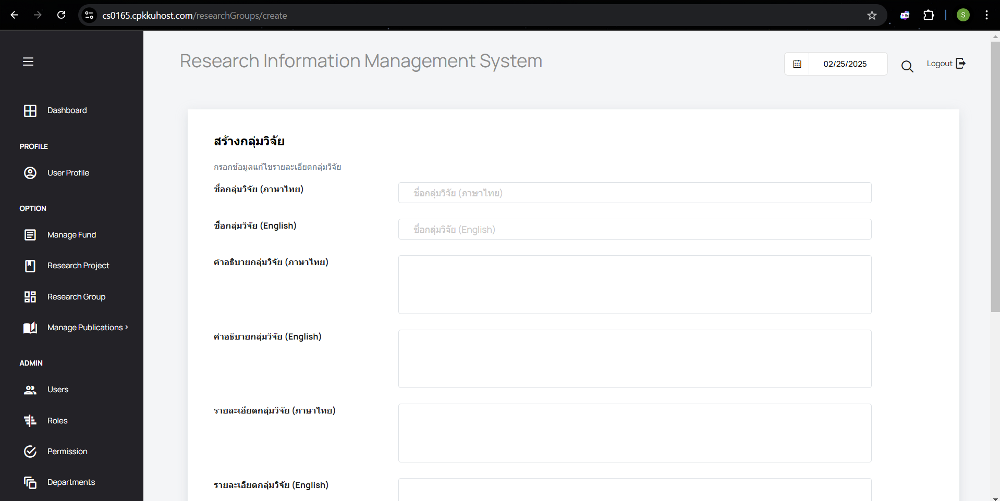
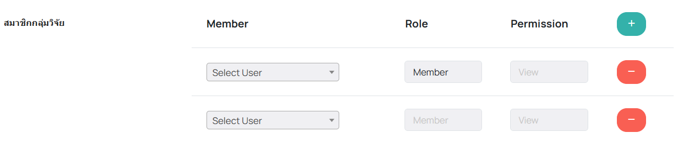
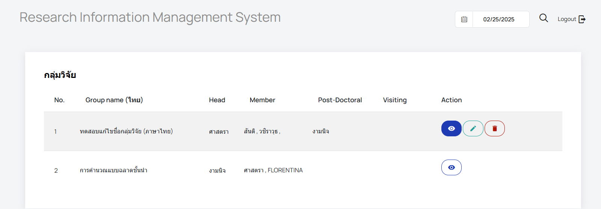
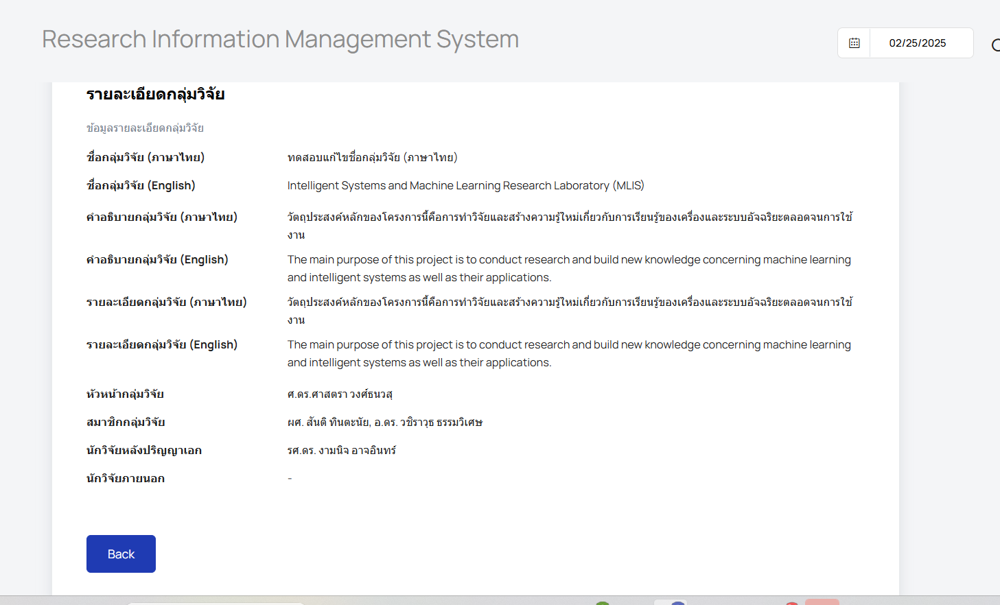
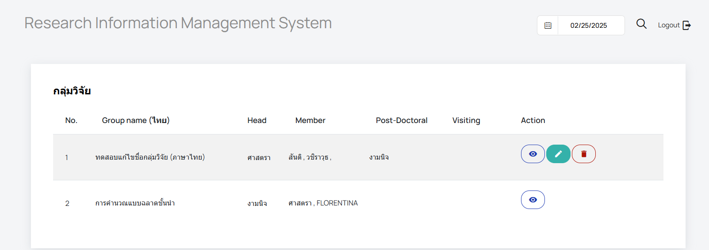
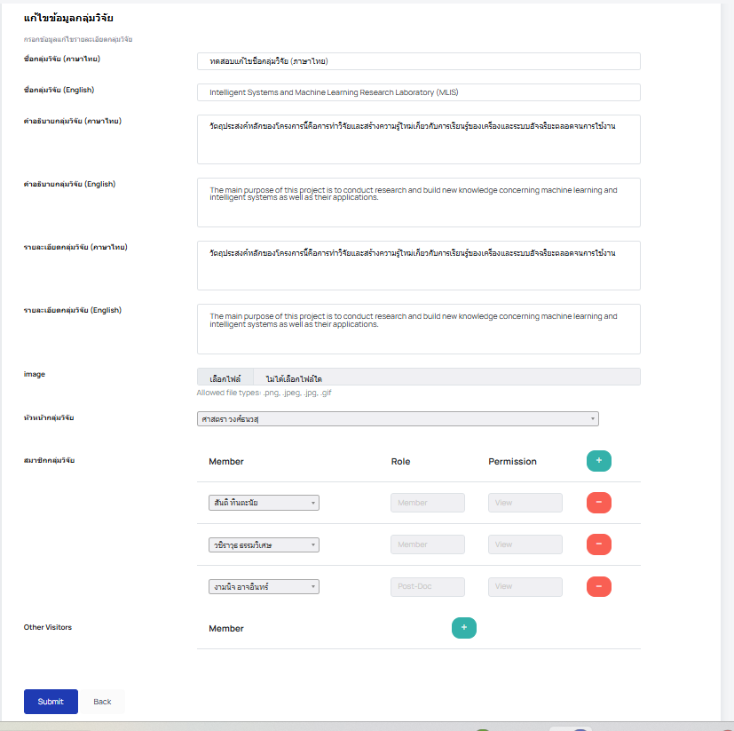
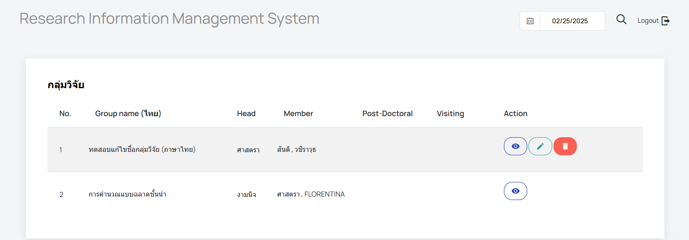
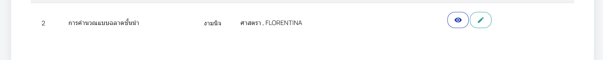

# User Manual
## เข้าสู่เว็บไซต์

1. เปิดเบราว์เซอร์ของคุณ (เช่น Google Chrome, Firefox, หรือ Microsoft Edge)
2. เข้าสู่เว็บไซต์โดยพิมพ์ URL ในแถบที่อยู่: URL: (https://cs0165.cpkkuhost.com)
   หรือ [Website](https://cs0165.cpkkuhost.com/)
3. เมื่อเข้าสู่หน้าแรกของเว็บไซต์แล้วจะแสดงเมนูหลักและฟังก์ชันต่าง ๆ
   
   

## เข้าสู่ระบบ
1. กดที่ปุ่ม LOGIN มุมขวาบนของเว็บไซต์
2. กรอก Username และ Password ที่ได้รับ จากนั้นกด LOG IN

   
3. เลือกเมนู Research Group จาก side bar

   

# 1. Admin 
1. ในเมนู Research Group จะแสดงกลุ่มวิจัยทั้งหมด โดย **Admin จะสามารถสร้าง ดู แก้ไข และลบ กลุ่มวิจัยได้**

   

## สร้าง กลุ่มวิจัย
1. คลิกปุ่ม ADD

   
2. เพิ่มเนื้อหากลุ่มวิจัย

   

   โดย Admin จะ**เป็นผู้ให้ตำแหน่งและสิทธิ์ในการ edit**

   
   
3. กดปุ่ม Submit หากสำเร็จจะกลับมายังหน้า กลุ่มวิจัยทั้งหมด และแจ้งเตือนว่า **"Research group created successfully."** ถือว่าเพิ่มกลุ่มวิจัยเสร็จสิ้นแล้ว

   

## ดู กลุ่มวิจัย
1. คลิกปุ่ม view ในคอลัมน์ Action

   
2. จะแสดงข้อมูลรายละเอียดต่าง ๆ ของกลุ่มวิจัยนั้น ๆ

   

## แก้ไข กลุ่มวิจัย
1. คลิกปุ่ม edit ในคอลัมน์ Action

   
2. จะแสดงข้อมูลรายละเอียดต่าง ๆ ของกลุ่มวิจัยนั้น ๆ และสามารถแก้ไขได้

   
3. เมื่อกด Submit หากสำเร็จจะกลับมายังหน้า กลุ่มวิจัยทั้งหมด และแจ้งเตือนว่า **"Research group updated successfully"** ถือว่าแก้ไขเสร็จสิ้นแล้ว

   
   
## ลบ กลุ่มวิจัย
1. คลิกปุ่ม Delete ในคอลัมน์ Action
   
   
2. จะขึ้นแจ้งเตือนว่า "Are you Sure?" หากกด OK จะเป็นการลบกลุ่มวิจัยนั้น หากกด Cancle จะเป็นการยกเลิกการทำงาน

   
3. หากลบสำเร็จจะกลับมายังหน้า กลุ่มวิจัยทั้งหมด และแจ้งเตือนว่า **"Research group deleted successfully"** ถือว่าลบเสร็จสิ้นแล้ว

   

# 2. Researcher
1. ในเมนู Research Group จะแสดงกลุ่มวิจัยทั้งหมดที่ researcher มีส่วนเกี่ยวข้อง
   
   
   
## 2.1 Headproject
1. หาก researcher เป็น **headproject จะสามารถดู แก้ไข และลบ กลุ่มวิจัยของตนเองได้**
   
   
   
### ดู กลุ่มวิจัย
1. คลิกปุ่ม view ในคอลัมน์ Action
   
   
2. จะแสดงข้อมูลรายละเอียดต่าง ๆ ของกลุ่มวิจัยนั้น
   
   

### แก้ไข กลุ่มวิจัย
1. คลิกปุ่ม edit ในคอลัมน์ Action
 
   
2. จะแสดงข้อมูลรายละเอียดต่าง ๆ ของกลุ่มวิจัยนั้น และสามารถแก้ไขได้
   
   
3. เมื่อกด Submit หากสำเร็จจะกลับมายังหน้า กลุ่มวิจัยทั้งหมด และแจ้งเตือนว่า **"Research group updated successfully"** ถือว่าแก้ไขเสร็จสิ้นแล้ว
   
   

### ลบ กลุ่มวิจัย
1. คลิกปุ่ม Delete ในคอลัมน์ Action

   
2. จะขึ้นแจ้งเตือนว่า "Are you Sure?" หากกด OK จะเป็นการลบกลุ่มวิจัยนั้น หากกด Cancle จะเป็นการยกเลิกการทำงาน
   
   
3. หากลบสำเร็จจะกลับมายังหน้า กลุ่มวิจัยทั้งหมด และแจ้งเตือนว่า **"Research group deleted successfully"** ถือว่าลบเสร็จสิ้นแล้ว
   
   

## 2.2 สมาชิกที่ได้รับสิทธิ์ Edit 
1. หาก researcher เป็น **สมาชิกในกลุ่มวิจัยที่ได้รับสิทธิ์ Edit จะสามารถดู แก้ไข กลุ่มวิจัยของตนเองได้**
   
   

   
### ดู กลุ่มวิจัย
1. คลิกปุ่ม view ในคอลัมน์ Action
   
   
2. จะแสดงข้อมูลรายละเอียดต่าง ๆ ของกลุ่มวิจัยนั้น
   
   

### แก้ไข กลุ่มวิจัย
1. คลิกปุ่ม edit ในคอลัมน์ Action
   
   
2. จะแสดงข้อมูลรายละเอียดต่าง ๆ ของกลุ่มวิจัยนั้น และสามารถแก้ไขได้
   
   
3. เมื่อกด Submit หากสำเร็จจะกลับมายังหน้า กลุ่มวิจัยทั้งหมด และแจ้งเตือนว่า **"Research group updated successfully"** ถือว่าแก้ไขเสร็จสิ้นแล้ว
   
   

